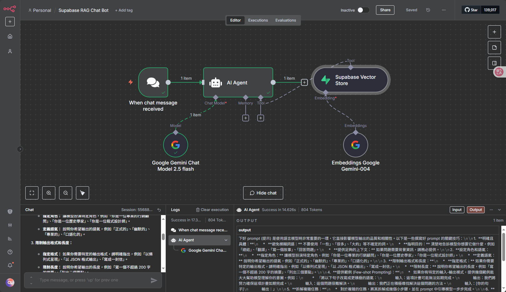

<!-- GitHub Profile 的設定檔案 README.md -->
<!-- 如果需要教學參考 docs/GitHubProfile.md -->

### 我是工程師 🐵
[View in English](./README_EN.md)
<!--
**chiisen/chiisen** is a ✨ _special_ ✨ repository because its `README.md` (this file) appears on your GitHub profile.

**chiisen/chiisen** 是一個 ✨ _特殊_ ✨ 儲存庫，因為它的 `README.md`（此檔案）出現在你的 GitHub 個人資料中。

Here are some ideas to get you started:

以下是一些可以幫助您入門的想法：

- 🔭 I’m currently working on ...
- 🌱 I’m currently learning ...
- 👯 I’m looking to collaborate on ...
- 🤔 I’m looking for help with ...
- 💬 Ask me about ...
- 📫 How to reach me: ...
- 😄 Pronouns: ...
- ⚡ Fun fact: ...

- 🔭 我目前正在研究...
-🌱 我目前正在學習...
- 👯 我正在尋找合作...
- 🤔 我正在尋求幫助......
-💬 問我關於...
- 📫 如何聯絡我：...
-😄 代名詞：......
-⚡有趣的事實：......
-->

<!-- 打字特效 -->
<h1 align="center">
  
</h1>

<!-- 程式碼美圖2 -->
  

---

[🔗https://chiisen.github.io](https://chiisen.github.io) 🏡 開源作品(持續累積中🏃‍♂️)(Jekyll版)  
[🔗https://104-5nh.pages.dev](https://104-5nh.pages.dev) 使用 Hexo 架設簡單的 104 個人履歷並發佈到 `cloudflare`  
[🔗https://docs-axs.pages.dev](https://docs-axs.pages.dev) ⭐️ 文章分享(持續累積中🏃‍♂️)(Hexo版)  
[🔗https://hackmd.io/@sam-liaw/SJnP2IgUI](https://hackmd.io/@sam-liaw/SJnP2IgUI) 104 履歷參考資料  

---

- 👨‍💻 工作經驗 15 年以上

也許你想知道:
- 👨‍💻 最近學習:  

---

Vibe Coding、  
[better-agents](https://github.com/chiisen/better-agents-html)、  
[Google Antigravity](https://github.com/chiisen/VibeCodingGamingPlatform)、  
[Codebuff](https://github.com/chiisen/VibeCodingCodebuff)、  
[Claude Code - Sub Agent](https://github.com/chiisen/ClaudeCodeManageMemory)、  
Claude Code Skills、  
Claude Code plugin ralph-wiggum、  
[GPT-5-Codex](https://github.com/chiisen/VibeCodingGPT5Codex)、  
[OpenSpec](https://github.com/chiisen/VibeCodingOpenSpec)、  
[iFlow CLI](https://github.com/chiisen/iFlowCLI) 、  
[Augment CLI](https://github.com/chiisen/AugmentCLI)、  
[Qwen CLI](https://github.com/chiisen/qwen_cli)、  
[Rovo Dev CLI](https://github.com/chiisen/RovoDevCLI)、  
[GitHub Copilot CLI](https://github.com/chiisen/GitHubCopilotCLI)、  
[CLine](https://github.com/chiisen/CLine)、  
[Trae](https://github.com/chiisen/Trae)、  
[Google AI Studio](https://github.com/chiisen/Google_AI_Studio)、  
[AnythingLLM RAG - 打造自己的地端 AI 客服系統、AI 知識庫系統、AI 智慧助理、AI 專家機器人](https://github.com/chiisen/AnythingLLM_RAG)、  
[Nano Banana Pro 提示詞工程神器](https://github.com/chiisen/NanoBananaPro)  
Cursor、Windsurf、Trae、Lingma  

---

- GitHub: Vibe Coding Gaming Platform  
  
<!-- 要空一行格式才不會亂 -->

[🔗Repositories: `VibeCodingGamingPlatform`](https://github.com/chiisen/VibeCodingGamingPlatform)  

---

- GitHub: OpenSpec (Spec-Driven Development)  
  
<!-- 要空一行格式才不會亂 -->

[🔗Repositories: `VibeCodingOpenSpec`](https://github.com/chiisen/VibeCodingOpenSpec)  

---

- GitHub: Spec-Kit (Spec-Driven Development)  
  
  
<!-- 要空一行格式才不會亂 -->

[🔗Repositories: `spec-kit-todo`](https://github.com/chiisen/spec-kit-todo)  

---

- GitHub: BMad-Method (Breakthrough Method for Agile AI-Driven Development)  
  
<!-- 要空一行格式才不會亂 -->

[🔗Repositories: `BMad-Method`](https://github.com/chiisen/BMad-Method)  

---

- AWS: Kiro  
  
<!-- 要空一行格式才不會亂 -->

[🔗Repositories: `KIRO`](https://github.com/chiisen/KIRO)  

---

- Context Engineering  
  
<!-- 要空一行格式才不會亂 -->

[🔗Repositories: `ContextEngineeringTemplate`](https://github.com/chiisen/ContextEngineeringTemplate)  

---

- MCP Server（Model Context Protocol Server）  
  
<!-- 要空一行格式才不會亂 -->

[🔗Repositories: `ClaudeLocalMCP.js`](https://github.com/chiisen/ClaudeLocalMCP.js)  
[🔗Repositories: `ClaudeLocalMCP.ts`](https://github.com/chiisen/ClaudeLocalMCP.ts)  
[🔗Repositories: `unity-mcp`](https://github.com/chiisen/unity-mcp)  

---

- OpenAI、Claude、Perplexity、NotebookLM  
  

---

- n8n + RAG(spuabase)  
  
  
<!-- 要空一行格式才不會亂 -->

[🔗Repositories: `n8n`](https://github.com/chiisen/n8n)  

---

- 👨‍💻 我的經歷(<a href="https://104-5nh.pages.dev" target="_blank">🔗 經歷詳細說明(Hexo 版)</a>):  

<a href="https://104-5nh.pages.dev/2017/06/30/salmon/" target="_blank">🔗 2018年01月05日 雪霸國家公園櫻花鉤吻鮭互動導覽程式</a>    
  

與台灣櫻花鉤吻鮭有關的互動遊戲，模擬國寶魚在溪流中的生態，遊客可藉由遊戲的互動內容，更加深入的認識國寶魚的棲地環境與生態知識。

---

<a href="https://104-5nh.pages.dev/2015/10/31/survivor/" target="_blank">🔗 2015/11~2016/10 倖存者聯盟</a>    
  

這是一款以全新末日角度打造的殭屍題材即時戰略手機遊戲，期待引爆全球生存之戰。

---

<a href="https://104-5nh.pages.dev/2013/10/31/we-dx/" target="_blank">🔗 2013/11~2014/10 唯舞獨尊 DX</a>    
  

全新打造的線上音樂節奏跳舞遊戲，遊戲保留了玩家熟悉的玩法，並收錄最多的華文歌曲。本作採用 Unity 3D 引擎打造，官方強調畫面比前作更為細緻。研發團隊在開發時訴求遊戲人物外觀和服裝較為貼近真人比例，但五官不會過於寫實而失去夢幻感。

---

<a href="https://104-5nh.pages.dev/2010/12/31/we-fb/" target="_blank">🔗 2011/1~2012/4 唯舞獨尊(臉書版)</a>    
  

具有多樣的音樂玩法模式，加上社交平台特有的好友互動、趣味分享等元素，讓玩家可以與好友一起聽音樂、玩遊戲。透過獨特的社交聊天功能，還能認識更多玩家一起同樂。

---

<a href="https://104-5nh.pages.dev/2005/11/30/we-online/" target="_blank">🔗 2005/12~2007/5 唯舞獨尊Online</a>   
  

這是一款結合時尚的音樂遊戲，玩家只需使用簡單的 4 個方向鍵，隨著音樂節拍操縱遊戲中的人物，與其他玩家進行對戰尬舞，非常考驗手指的反應和節奏感。

---

- 🏡 開源作品(持續累積中🏃‍♂️):  
<a href="https://chiisen.github.io" target="_blank">🔗 "🏡 開源作品介紹網站(持續累積中🏃‍♂️)(Jekyll版)"</a>  

<a href="https://github.com/chiisen?tab=repositories" target="_blank">🔗 Read More</a>  

---

- ⭐️ 文章分享(持續累積中🏃‍♂️):  
<a href="https://docs-axs.pages.dev" target="_blank">🔗 "🏡 文章分享介紹網站(持續累積中🏃‍♂️)(Hexo版)"</a>  

<a href="https://github.com/chiisen?tab=repositories" target="_blank">🔗 Read More</a>  

---

## ✨ Github 今年總結  

---

### 📋 Languages
<!-- Icon 圖片網址可以參考: https://github.com/Ileriayo/markdown-badges -->

---

### 💻 IDEs/Editors

---

### 💾 Databases

---

### ☁️ Hosting/SaaS

---

### 🎛️ Operating System

---

### 🗄️ Servers

---

### 💬 Social

---

### 🧪 Testing

---

### 🥅 Other

### AI

